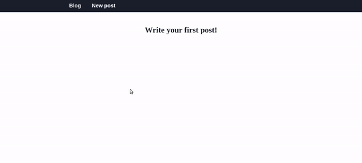

# Blog Vue.js



Простое приложение для публикации постов на Vue.js.

**Стек**: Vue.js, Vuex, CSS (flex), HTML5.

### Функционал:
- Можно создать пост, указав заголовок, аннотацию и текст.
- К посту можно добавлять комментарии, указав имя автора и текст.
- Комментарии и посты можно удалять.
- Посты можно редактировать.
- Данные сохраняются в local storage браузера.

### Что планируется реализовать:
- Возможность добавлять реплаи (комментарии в ответ на комментарии).
- Возможность добавлять в посты изображения и видео.
- Возможность переключать тему приложения.

### Запуск проекта:

Установить зависимости:
```
npm install
```
Запустить в режиме разработки:
```
npm serve
```
Подготовить на продакшн:
```
npm build
```